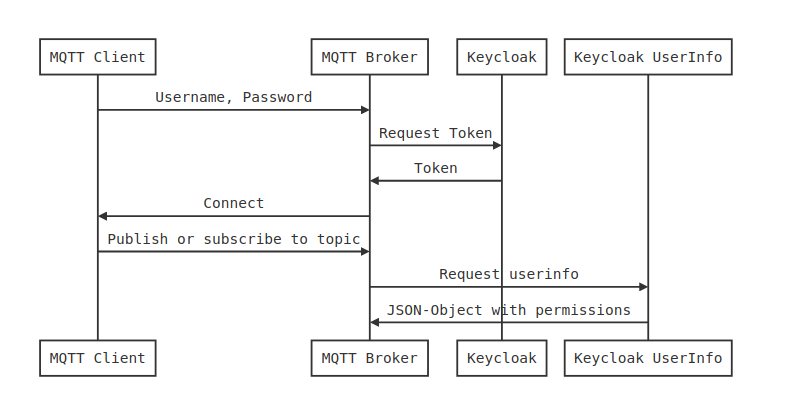
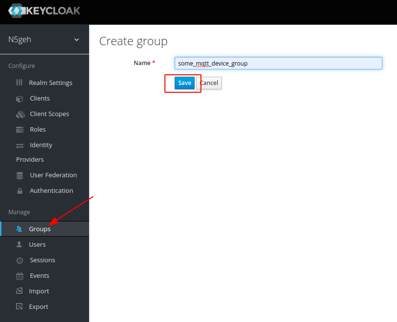
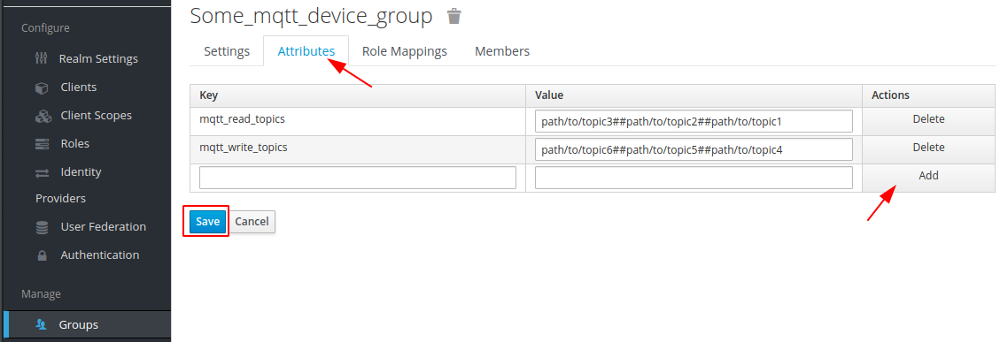
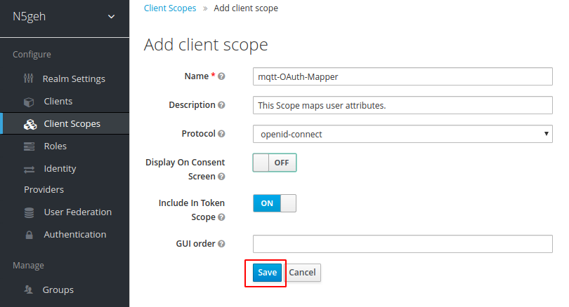
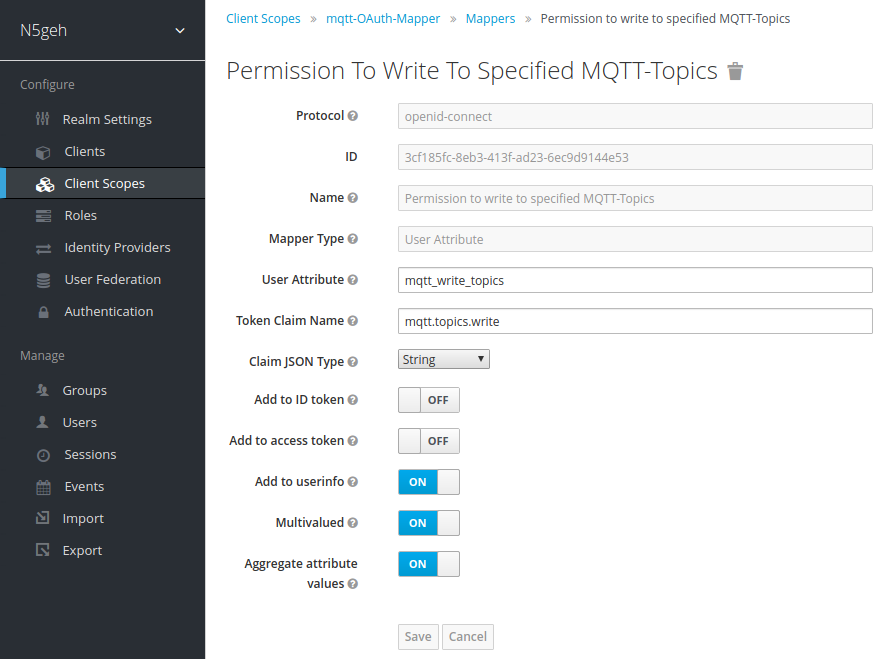
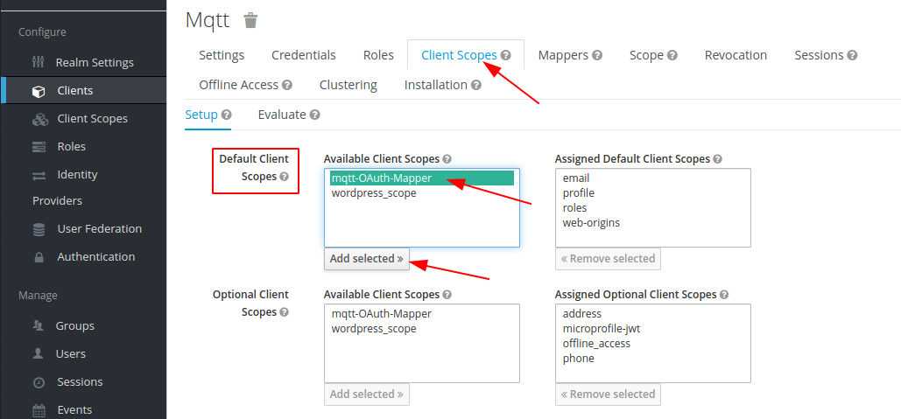
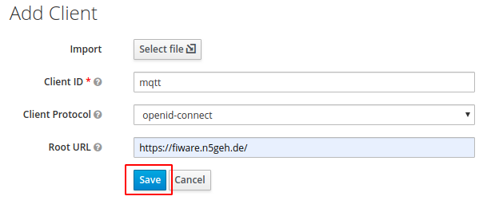
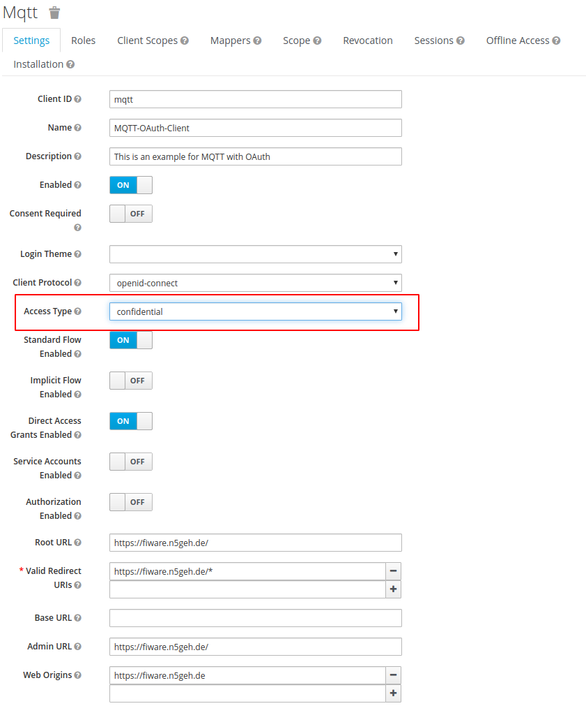

# Keycloak Configuration for MQTT

This article describes the configuration for [Keycloak](https://www.keycloak.org/) and Mosquitto if used with the [Mosquitto MQTT-Broker](https://mosquitto.org/) and it's [OAuth-Go-Plugin](https://github.com/karlTGA/mosquitto-go-auth-oauth2/tree/v1.0). 

The Plugin uses the username and password of the MQTT-client to authenticate it with Keycloak. The client's permissions are retrieved by a request against the user-info endpoint of Keycloak, using it's bearer token. These permissions are stored in the user- resp. group-attributes in Keycloak. Those attributes can be attached to the user-info by adding the corresponding mappers to the Keycloak-client (this is not the MQTT-client mentioned beforehand). As a result there has to be no additional OAuth-Flow implemented with the MQTT-Client.



A step by step instruction can be found below.


### 1. Add a Group with Attributes

We use attributes to handle the permissions of MQTT-Clients. Those attributes can be assigned to users directly or - more conveniently - managed within a group which can be assigned to the MQTT-clients Keycloak-user. So if we have a specific group of devices, which are supposed to have multiple read and write permissions on different topics we can start by adding the respective group in Keycloak.


Click on "Groups", then on "New" and assign a unique and preferably human readable name to that group. Save that group.



Select "Attributes" from the tab and add permissions by assigning key-value pairs to that group. Click "Add" and "Save" to save these pairs.

There are three different kinds of keys which can be multi-valued and are specific to prevent future attribute conflicts. These groups are realm wide. These attributes can be named differently but it is advisable to stick to one naming convention.

| Attribute         | Type                  | Info                                                         |
| :---------------- | :-------------------- | :----------------------------------------------------------- |
| mqtt_read_topics  | (multi-valued) string | Defines which topics can be read by this group.              |
| mqtt_write_topics | (multi-valued) string | Defines which topics can be written to by this group. (Does not include read permission) |
| mqtt_superuser    | Boolean (true, false) | Defines a superuser which has admin privileges on the broker. (Can be omitted if false). |

Multi-values are separated by double hashtags. You can use + and * for wildcards in the typical MQTT manner.

```
path/to/topic6##path/to/topic5##path/+/topic4/*
```



Attributes can also be assigned to **single users** in the same manner. Just navigate to "Users", select the user you would like to assign a special attribute to and select "Attributes" from the tab. Be sure to use the same keys though.

### 2. Add a Client Scope and Mappers

These attributes need to be mapped to the client. To have one generic mapping for that we can add a "Client Scope".

To do so, select "Client Scopes" in the left-side menu and click "Create". Give it a name, use the openid-connect protocol and include it in the token scope like shown below. Click save to proceed.



You will be fowarded into the new client scope's "edit-view". Select the "Mappers"-tab and click "Create".

To add a mapper for the writing permission you can choose a comprehensive name, choose the mapper type "User Attribute" and add the attribute we just gave to the group. 

The "Token Claim Name" here is very important, because it will directly effect the JSON-object we use for the Mosquitto-plugin. The dots will create nested JSON-objects. Valid token claim names are as follows:

| Token Claim Name  | Corresponding Attribute | Claim JSON Type | Multivalued | Aggregate attribute values |
| :---------------- | :---------------------- | :-------------- | :---------- | :------------------------- |
| mqtt.topics.write | mqtt_write_topics       | string          | Yes         | Yes                        |
| mqtt.topics.read  | mqtt_read_topics        | string          | Yes         | Yes                        |
| mqtt.superuser    | mqtt_superuser          | boolean         | No          | Yes                        |

To make these permission mappers accessible to the Mosquitto-plugin they need to be added to the userinfo.

Multivalued means that the attributes for read and write with values separated by hashtags will be individual values of the JSON-object write / read. So superuser as a boolean does not need that. Aggregate just defines whether attributes assigned to users and groups should be aggregated. So if a user does have an additional topic assigned to write for example, it will also show up together with the group attributes. **Boolean group attributes are overruled by user attributes!** So if a user does have the attribute "mqtt_superuser: true" it will always show as true at the user info endpoint regardless of group attributes.

Be sure to add a mapper for every token claim name you would like to show up (you might omit superuser).



### 3. Add the Scope to the Client

To make these mappers accessible to your MQTT-Broker you need to add the scope to the auth-client you are using for the MQTT-Broker. In order to do that, select Clients from the left-side menu, and select your auth-client for MQTT. Navigate to the "Client Scopes" tab and select the scope you just created from the optional client scopes. Press "Add selected" and the mappers are active.



You successfully set up your permission mappers. You can now add users to your groups or attributes directly to a user. The response from Keycloak to the MQTT-broker will look like this:

**JSON-Response**

```json
...
"mqtt": {
        "topics": {
            "read": [
                "path/to/topic2",
                "path/to/topic1",
                "path/to/topic3"
            ],
            "write": [
                "path/to/topic4",
                "path/to/topic6",
                "path/to/topic5"
            ]
        },
        "superuser": false
},
...
```

### 4. Add a Broker-Client to Keycloak

To add a broker client to Keycloak you can simply click on "Clients", "Add", provide a name and configure the Client as described below.



You will be forwarded to the edit page of the new client.



Make sure to change "Access Type" to confidential and click save. The "Credentials" tab will appear at the top and you can get the client-secret there. And remember to set your redirect URI etc. to your backend's URL.

### 5. Run the Mosquitto-Broker
As a first step you should clone the repository using:

`git clone https://github.com/karlTGA/mosquitto-go-auth-oauth2.git`

It does come with an example configuration which has to be changed even without use in production.

#### Configuration
Be aware that Mosquitto 1.6 uses a different password hashing than it's predecessors. Old password files won't work any longer and **Mosquitto alters it's hashing with every docker build**. So you have to use volumes to make the password file work, because prehashed passwords copied to the container while building won't work.

Traefik is not able to provide normal MQTT without Websockets since it is only handling http-requests. So if you'd like to use normal MQTT-protocol please provide the according ca- and cert-files.

Then you can use port 8883 for example to have mqtts as well. 

Review your mosquitto.conf and alter it according to your setup.

Once you created the container running docker-compose up -d you can use the following command to hash passwords for your mosquitto passwordfile:

`docker-compose exec mosquitto pw -p 'password to hash'` 

Put the hash into your password-file in the /auth folder and restart Mosquitto.

**Checklist for configuration:**

* Specify the ports and protocol on which mosquitto listens in mosquitto.conf
* Define a log-level (error is recommended for production)
* Define which backends you would like to use (file, plugin etc. - see mosquitto documentation for further information) in go-auth.conf
* Provide your endpoints and client ID / secret in go-auth.conf

#### Known Bugs
UPDATE: These bugs might be fixed with the newest version available on Docker-Hub. I wasn't yet able to recreate them. Please let me know of any occurring bugs.

~~The plugin doesn't refresh access-tokens yet. So when the access-token (which tends to have a short expiration time) expires, the plugin will deny access to the broker. This applies for clients which stay connected to a broker.~~

Offline Tokens haven't been implemented. So The Client needs to reconnect after a session timeout (when refresh tokens becomes invalid). To preserve functionality you could do one of three things:

* Increase *SSO Session Max* in Keycloak - Realm Settings - Tokens
* Implement a reconnect-functionality into the client-application
* Add the client-application to the ACL-List

